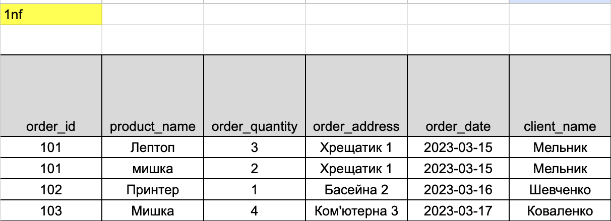
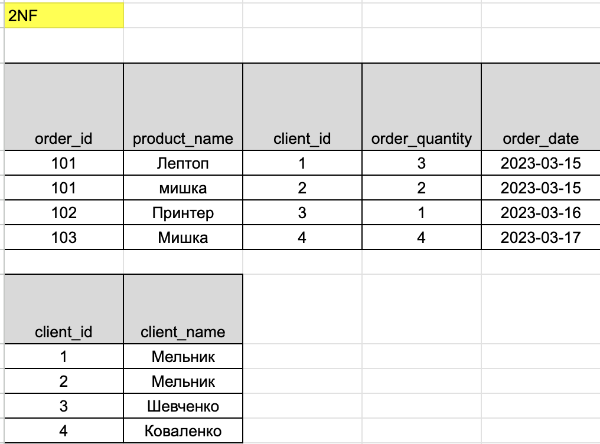
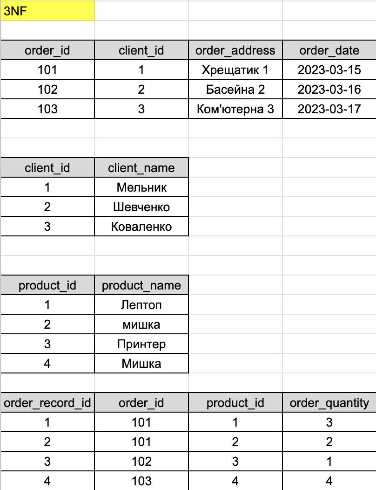
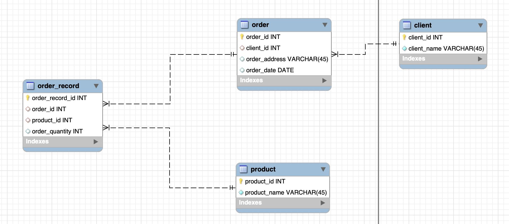
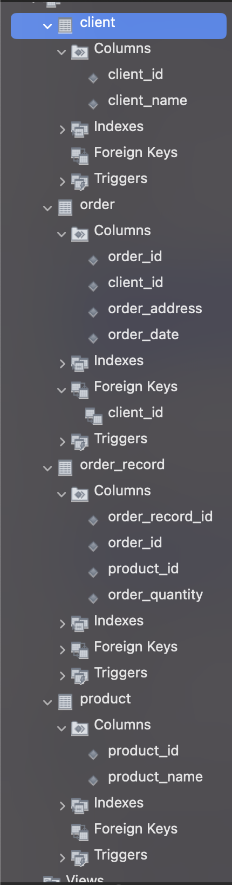

# Домашнє завдання до Теми 2. Проектування баз даних з використанням семантичних моделей

#### Початкова таблиця

## Критерії прийняття

1. Прикріплені посилання на репозиторій `goit-rdb-hw-02` та безпосередньо самі файли репозиторію архівом.

2. Нормалізовано таблицю до 1НФ.

3. Нормалізовано таблицю до 2НФ.

4. Нормалізовано таблицю до 3НФ.

- 💡 Результат нормалізації таблиць може бути в довільній формі/форматі (Google Doc, Google таблиці тощо).

5. Створено ER-діаграму отриманих таблиць. Діаграма має відповідати нормалізованим таблицям.

- 💡 Має бути декілька таблиць зі зв’язком між ними. Результат може бути у вигляді файлу та/або скриншота.

6. Використано зрозумілі та конкретні імена для сутностей та атрибутів. Уточнено типи даних для атрибутів. Усі відношення й атрибути мають чіткі і зрозумілі кардинальності та значення.

7. Створено таблиці в базі даних (тільки таблиці й колонки з урахуванням зв'язків) вручну або автоматично.
5. Створено ER-діаграму отриманих таблиць. Діаграма має відповідати нормалізованим таблицям.

